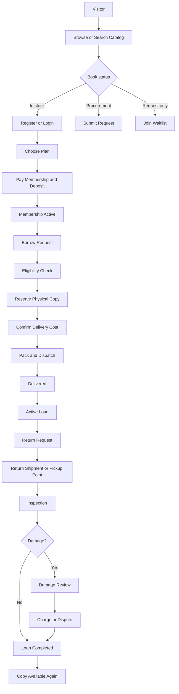
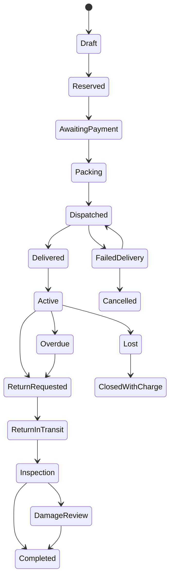
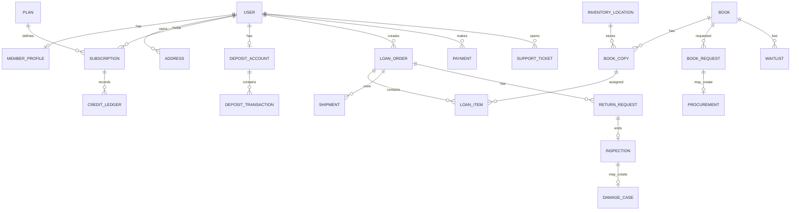

# Nationwide Book-Rental Website — Detailed Developer Plan

**Project type:** Subscription-based physical book-rental platform  
**Primary market:** Bangladesh  
**Initial launch:** Small controlled pilot, then gradual expansion  
**Primary device:** Mobile phone  
**Document purpose:** Developer handoff, product planning, estimation, implementation, and testing  
**Prepared for:** Sourov Biswas  

---

# 1. Project Summary

The website will allow members to:

1. Create an account.
2. Select a membership plan.
3. Pay a membership fee and refundable security deposit.
4. Search the book catalog.
5. See whether a book is currently available, can be procured, or is request-only.
6. Borrow one or more books depending on their plan.
7. Pay delivery charges.
8. Track delivery.
9. Keep the book for a fixed period.
10. Request a return pickup or return through a pickup point.
11. Renew a loan when allowed.
12. View due dates, history, payments, deposit balance, and requests.
13. Exit the service and request a deposit refund.

The admin team will be able to:

1. Manage members and subscriptions.
2. Manage book titles and physical copies separately.
3. Manage requests, waitlists, procurement, inventory, loans, returns, damage, and loss.
4. Record payments and refundable deposits separately.
5. Book and track courier shipments.
6. Send notifications.
7. Manage plans, prices, service areas, policies, and website content.
8. View business reports and key performance indicators.

---

# 2. Product Goals

## 2.1 Main goals

- Make book discovery and borrowing simple.
- Make stock and delivery information honest and clear.
- Support a low-inventory, demand-based purchasing model.
- Keep manual operation possible during the pilot.
- Make later automation easy.
- Protect the business from book loss, damage, fraud, and deposit mistakes.
- Give customers a trustworthy and transparent experience.
- Build the system so a mobile app can use the same backend later.

## 2.2 Success conditions

The first version is successful when a member can complete this full cycle:

> Register → pay → borrow → receive → return → inspection completed → borrow again.

The admin should be able to manage the entire cycle without editing the database manually.

## 2.3 Non-goals for the first release

Do not build these in the MVP:

- Native Android or iOS application
- AI book recommendation
- Social network or public member profiles
- Third-party sellers or book owners
- Unlimited borrowing plans
- Complex reward-point system
- Multiple payment gateways at the same time
- Multiple automated courier integrations at the same time
- Advanced warehouse routing
- Automated damage detection
- E-book or audiobook delivery
- Marketplace for buying and selling books

---

# 3. Recommended Development Approach

## 3.1 Recommended architecture

For a small team, use a modular monolith.

Recommended setup:

- **Backend:** Laravel or another framework the team already knows well
- **Frontend:** Server-rendered pages with Blade/Livewire/Alpine, or a simple React/Vue frontend
- **Database:** PostgreSQL or MySQL
- **Queue:** Database queue at first; Redis later if needed
- **Scheduler:** Framework scheduler for reminders and status checks
- **File storage:** S3-compatible object storage for book covers, condition photos, invoices, and documents
- **Email:** Transactional email provider
- **SMS/WhatsApp:** Add through a notification adapter
- **CDN and security:** Cloudflare
- **Monitoring:** Error tracking, uptime monitoring, and application logs
- **Deployment:** Managed VPS, container platform, or Cloudflare-supported backend depending on team experience

The fastest option for this project is usually:

> Laravel monolith + Blade/Livewire + MySQL/PostgreSQL + queue worker + scheduled jobs.

This avoids the complexity of maintaining separate frontend and backend applications.

## 3.2 API-ready design

Even if the first website is server-rendered:

- Put business logic in services, not controllers or page components.
- Use versioned internal/public endpoints such as `/api/v1`.
- Use resource classes or serializers.
- Use policies for permissions.
- Use events for payment, shipment, return, and notification actions.
- Keep courier and payment code behind interfaces or adapters.

This will make a future Android app easier.

---

# 4. Development Phases

## Phase 0 — Validation website

Purpose: collect demand before building the full platform.

Features:

- Home page
- How it works
- Pilot pricing
- Searchable catalog
- Honest availability labels
- Request-a-book form
- Waitlist form
- Facebook Pixel/analytics
- Contact through Messenger or WhatsApp
- Basic admin export of leads and requests
- Terms, privacy, delivery, deposit, and refund pages

No online borrowing is needed in this phase.

## Phase 1 — Concierge MVP

Purpose: operate the first 30–50 paid members.

Features:

- Account registration and login
- Member profile and address
- Plan selection
- Manual payment verification
- Membership and deposit records
- Catalog and book details
- Borrow request
- Manual admin approval
- Loan creation
- Manual courier tracking entry
- Due-date reminders
- Return request
- Inspection and damage recording
- Member dashboard
- Admin dashboard
- Reports and CSV export

Most operations can be manual.

## Phase 2 — Automated beta

Purpose: support 100–500 active members.

Features:

- Payment gateway integration
- One courier integration
- Automatic status updates
- Automatic email/SMS/WhatsApp notifications
- Waitlist automation
- Procurement queue
- Refund workflow
- Barcode or QR scanning
- Referral codes
- Better analytics
- Role-based admin permissions
- Pickup-point support

## Phase 3 — Scale version

Purpose: support multiple cities, hubs, and larger inventory.

Features:

- Multiple hubs and storage locations
- Routing books to the nearest hub
- Multiple courier adapters
- Corporate and family accounts
- Publisher/supplier portal
- Advanced inventory forecasting
- Mobile app
- Recommendation engine
- Loyalty program
- Warehouse scanning
- Bulk operations
- Advanced fraud and risk checks

---

# 5. User Roles and Permissions

## 5.1 Visitor

Can:

- Browse public pages
- Search catalog
- View book details
- View plans
- Submit book requests
- Join waitlist
- Register
- Contact support

Cannot:

- Borrow books
- See member-only data
- See internal stock details

## 5.2 Pending member

A registered user who has not completed payment or verification.

Can:

- Complete profile
- Add address
- Select plan
- Upload or submit required verification information
- Pay membership and deposit
- Contact support

Cannot:

- Borrow books

## 5.3 Active member

Can:

- Borrow according to plan
- View credits and limits
- Request renewal
- Request return pickup
- Join waitlist
- View deposit balance
- View loan and payment history
- Submit support tickets
- Request membership exit

## 5.4 Suspended or overdue member

Can:

- View account
- Pay charges
- Return books
- Contact support
- Request review

Cannot:

- Create a new borrowing request

## 5.5 Support agent

Can:

- View member profile
- View loans and shipments
- Create support tickets
- Add internal notes
- Resend notifications
- Help with return requests

Cannot:

- Change deposit balance
- Approve refunds
- Delete financial records
- Change plan pricing

## 5.6 Inventory operator

Can:

- Receive books
- Create physical copies
- Add condition reports
- Pack shipments
- Scan returns
- Move copies between statuses
- Mark repair or retirement

Cannot:

- Approve deposit deductions
- Edit financial settings

## 5.7 Finance manager

Can:

- Verify payments
- Manage deposit ledger
- Approve refunds
- Record charges
- Reconcile payment records
- Export financial reports

Cannot:

- Delete loan history
- Change physical book condition without evidence

## 5.8 Content manager

Can:

- Add and edit titles
- Manage authors, categories, publishers, covers, descriptions, and SEO
- Manage home page, FAQ, policy pages, and banners

Cannot:

- Manage loans or money

## 5.9 Operations manager

Can:

- Manage loans
- Manage procurement
- Manage courier shipments
- Approve renewal
- Resolve operational exceptions
- View reports

## 5.10 Super administrator

Has all permissions.

All sensitive admin actions should be written to an audit log.

---

# 6. Core Domain Concepts

## 6.1 Book title and physical copy must be separate

A title is the general book record.

Example:

- Title: *Atomic Habits*
- Author: James Clear
- ISBN: ...
- Language: English

A physical copy is one owned unit.

Example:

- Copy code: AB-0001
- Purchase cost: ৳350
- Condition: Good
- Status: Borrowed
- Current location: Main storage

One title may have many physical copies.

## 6.2 Availability types

Each book title must have one public availability type:

### In Stock

The business owns at least one borrowable copy.

Public message examples:

- Available now
- One copy available
- All copies borrowed; next expected availability shown

### Procurement

The business does not currently have a copy, but it expects to buy one after a valid request.

Public message example:

> Available by procurement. Estimated preparation time: 3–7 working days after confirmation.

The member should not receive an immediate delivery promise.

### Request Only

Availability or price is uncertain.

Public message example:

> Request this book. We will notify you if it becomes available.

### Temporarily Unavailable

The title cannot currently be ordered because of supplier or operational problems.

### Discontinued

The service does not plan to provide the title.

## 6.3 Borrowing credits

A plan controls:

- Maximum books at one time
- Maximum credits per month
- Maximum replacement value
- Loan duration
- Renewal permission
- Service areas
- Whether premium titles are allowed

Suggested credit rule:

- Normal book: 1 credit
- Expensive or oversized book: 2 credits
- A cancelled order before dispatch returns the credit
- A failed delivery caused by the courier returns the credit
- A failed delivery caused by wrong customer information may not return delivery charges
- Monthly credits expire unless the business later decides otherwise

## 6.4 Deposit

Deposit is a refundable liability.

The system must:

- Store every deposit transaction
- Show current refundable balance
- Store deductions separately
- Require evidence and approval for deduction
- Prevent accidental use as revenue
- Support partial and full refunds
- Keep a complete ledger
- Never allow the deposit amount to be silently edited

## 6.5 Loan

A loan connects:

- Member
- Subscription
- One or more physical copies
- Outbound shipment
- Due date
- Return shipment
- Inspection
- Charges
- Completion

## 6.6 Reservation

A reservation temporarily holds an available copy.

Suggested rules:

- Reservation expires if payment or confirmation is not completed within a configured time.
- A copy cannot be reserved for more than one member.
- Admin can manually extend a reservation.
- Waitlisted members are offered the copy in order.

---

# 7. Public Website Sitemap

```text
/
├── Home
├── Catalog
│   ├── Search Results
│   ├── Category
│   ├── Author
│   ├── Publisher
│   └── Book Details
├── How It Works
├── Membership Plans
├── Request a Book
├── Service Areas
├── Delivery Charges
├── Pickup Points
├── About
├── Blog / Reading Guides
├── FAQ
├── Contact / Complaint
├── Login
├── Register
└── Policies
    ├── Membership Terms
    ├── Deposit and Refund Policy
    ├── Delivery and Return Policy
    ├── Late, Loss, and Damage Policy
    ├── Cancellation Policy
    ├── Privacy Policy
    └── Acceptable Use Policy
```

---

# 8. Member Dashboard Sitemap

```text
/member
├── Overview
├── Browse Books
├── My Current Books
├── Borrowing History
├── My Requests
├── My Waitlists
├── My Subscription
├── Credits and Limits
├── Deposit Balance
├── Payments and Receipts
├── Delivery Tracking
├── Return Requests
├── Saved Addresses
├── Referrals
├── Notifications
├── Support Tickets
├── Profile and Verification
├── Security
└── Exit Membership
```

---

# 9. Admin Dashboard Sitemap

```text
/admin
├── Dashboard
├── Members
├── Applications and Verification
├── Plans and Subscriptions
├── Deposits
├── Payments
├── Refunds
├── Catalog
│   ├── Titles
│   ├── Authors
│   ├── Publishers
│   ├── Categories
│   ├── Languages
│   └── Import
├── Inventory
│   ├── Physical Copies
│   ├── Locations
│   ├── Condition Reports
│   ├── Repairs
│   └── Retired/Lost Copies
├── Requests and Waitlists
├── Procurement
├── Loans
├── Reservations
├── Returns and Inspections
├── Damage and Loss Cases
├── Courier Shipments
├── Pickup Points
├── Service Areas
├── Notifications
├── Support Tickets
├── Referrals and Promotions
├── Reports
├── Website Content
├── Policies
├── Staff and Roles
├── Settings
├── Integrations
├── Audit Logs
└── System Health
```

---

# 10. Public Page Requirements

## 10.1 Home page

### Purpose

Explain the service within a few seconds and move the visitor toward searching, requesting, or joining.

### Sections

1. Hero section
   - Main promise
   - Short explanation
   - “Browse Books” button
   - “See Plans” button

2. How it works
   - Join
   - Select or request
   - Receive
   - Read
   - Return
   - Borrow again

3. Featured books
   - In-stock titles
   - Most requested titles
   - Newly added titles

4. Plan summary
   - Membership cost
   - Refundable deposit shown separately
   - Delivery not included

5. Availability explanation
   - In Stock
   - Procurement
   - Request Only

6. Why use the service
   - Save shelf space
   - Avoid buying every book
   - Request titles
   - Easy tracking
   - Transparent deposit

7. Service-area notice

8. Reviews and social proof

9. FAQ

10. Final call to action

### Acceptance criteria

- Visitor can understand the main service without scrolling far.
- Membership fee and deposit are not mixed.
- Delivery charge is clearly mentioned.
- Book availability labels are explained.
- Main buttons are easy to tap on mobile.

## 10.2 Catalog page

### Features

- Search input
- Autocomplete
- Filters
- Sorting
- Pagination or infinite scroll
- Availability labels
- Book cover
- Title
- Author
- Language
- Credit cost
- Replacement-value warning when applicable
- Request button
- Borrow button for members
- Login/join prompt for visitors

### Filters

- Availability
- Language
- Category
- Author
- Publisher
- Age group
- Format
- Credit cost
- Premium or normal
- Newly added
- Popular
- Most requested

### Search behavior

Search by:

- Title
- Author
- ISBN
- Publisher
- Bangla spelling
- English spelling
- Common transliteration
- Alternate title

No-result state:

> Could not find the book? Request it.

## 10.3 Book details page

### Required information

- Cover
- Title
- Subtitle
- Author
- Translator
- Publisher
- Language
- Edition
- ISBN
- Number of pages
- Category
- Short description
- Availability
- Credit cost
- Replacement value
- Expected dispatch or procurement time
- Number of active waitlist members
- Loan period
- Renewal rule
- Similar titles
- Member rating later
- Request or borrow button

### Availability display examples

**In stock**

> Available now. Expected dispatch within 1–2 working days.

**All copies borrowed**

> All copies are currently borrowed. Join the waitlist. Estimated next availability: 18 August.

**Procurement**

> We do not currently own this title. Request it and we will confirm price and availability before procurement.

**Request only**

> Submit a request. We will notify you if the title becomes available.

## 10.4 Plans page

Each plan must show:

- Name
- Duration
- Membership price
- Refundable deposit
- Maximum books at one time
- Monthly credits
- Loan period
- Renewal rule
- Book-value limit
- Service areas
- Delivery charge rule
- Pause/cancel rule
- Exit/refund rule
- Join button

Do not use hidden text for important limits.

## 10.5 Request-a-book page

Fields:

- Book title
- Author
- Language
- Publisher
- ISBN if known
- Link to the book if known
- Cover upload optional
- Why the user wants it
- Preferred edition
- Maximum acceptable waiting time
- Member or guest contact

Behavior:

- Search the catalog first.
- Warn about possible duplicate requests.
- Connect duplicate requests to the same title.
- Create a request count.
- Notify the user when status changes.

## 10.6 Service areas page

For each location show:

- Active, pilot, waitlist, or unavailable
- Available courier or pickup method
- Typical delivery time
- Delivery-charge note
- Return method
- Special restrictions

## 10.7 Contact and complaint page

Fields:

- Name
- Phone/email
- Order or loan number
- Category
- Message
- File upload
- Preferred contact method

Must create a ticket number.

---

# 11. Registration and Onboarding

## 11.1 Registration fields

Minimum:

- Full name
- Phone number
- Email optional but recommended
- Password or OTP login
- Preferred language
- City/district
- Referral code optional
- Terms acceptance

## 11.2 Phone verification

Recommended:

- Verify phone with OTP.
- Rate-limit OTP requests.
- Expire OTP.
- Prevent repeated abuse.
- Store verification timestamp.

## 11.3 Profile completion

Fields:

- Date of birth or age confirmation if required
- Occupation
- Institution/company optional
- Full delivery address
- District
- Thana/upazila
- Postal code
- Landmark
- Alternative phone
- Emergency contact optional
- National ID or student ID only if the business decides it is necessary
- Preferred categories
- Reading frequency

Collect only information that is needed.

## 11.4 Onboarding steps

```text
Create account
→ Verify phone
→ Complete profile
→ Select plan
→ Review membership, deposit, and delivery rules
→ Pay
→ Verification/approval if required
→ Membership activated
→ Choose first book
```

## 11.5 Onboarding checklist

The dashboard should clearly show incomplete items:

- Phone verified
- Address added
- Plan selected
- Membership paid
- Deposit paid
- Identity reviewed if required
- Membership active

---

# 12. Subscription System

## 12.1 Plan fields

- Name
- Slug
- Public description
- Duration in days/months
- Membership price
- Deposit requirement
- Maximum active books
- Monthly credits
- Maximum replacement value
- Default loan duration
- Renewal days
- Number of renewals
- Premium-title access
- Allowed service areas
- Active/inactive
- Display order
- Terms version

## 12.2 Subscription fields

- Member
- Plan
- Start date
- End date
- Status
- Current period
- Credits allocated
- Credits used
- Auto-renew status
- Renewal reminder status
- Cancellation request
- Exit request
- Policy version accepted

## 12.3 Subscription statuses

- `pending_payment`
- `pending_verification`
- `active`
- `paused_by_service`
- `overdue_blocked`
- `expired`
- `exit_requested`
- `refund_review`
- `closed`
- `cancelled`

## 12.4 Credit reset

A scheduled job should:

- Reset monthly credits on the correct date.
- Keep an audit record.
- Avoid resetting twice.
- Notify the member.
- Handle subscription renewal periods correctly.

---

# 13. Borrowing Workflow

## 13.1 Member checks before borrowing

The system must verify:

- Active membership
- Verified contact
- Allowed service area
- No overdue items
- No unresolved damage/loss case
- Available active-book slot
- Enough credits
- Book within value limit
- Available copy or valid procurement flow
- Valid address
- Delivery method selected

## 13.2 In-stock borrowing flow

```text
Member selects book
→ System checks eligibility
→ System reserves a physical copy
→ Delivery charge is shown
→ Member confirms and pays if needed
→ Admin receives packing task
→ Copy is inspected and photographed
→ Courier shipment is created
→ Member receives tracking
→ Delivery confirmed
→ Loan start and due date are set
```

## 13.3 Procurement borrowing flow

```text
Member requests title
→ Request enters procurement queue
→ Admin checks supplier, price, and expected reuse
→ Admin approves or rejects
→ Member receives estimate
→ Member confirms
→ Book is purchased
→ Physical copy is created
→ Copy is reserved for requester
→ Normal packing and delivery flow begins
```

## 13.4 Waitlist flow

```text
All copies unavailable
→ Member joins waitlist
→ System stores position
→ Copy becomes available
→ First eligible member receives offer
→ Offer expires after configured time
→ If not accepted, next member receives offer
```

## 13.5 Order cancellation

Before dispatch:

- Member may cancel.
- Credit is returned.
- Delivery payment is refunded or reversed according to policy.
- Reservation is released.

After dispatch:

- Cancellation is not normal.
- It becomes a failed/returned shipment case.
- Delivery costs may still apply.

---

# 14. Loan Statuses

Recommended loan status flow:

```text
draft
→ awaiting_confirmation
→ reserved
→ awaiting_payment
→ packing
→ ready_for_dispatch
→ dispatched
→ delivered
→ active
→ return_requested
→ return_booked
→ return_in_transit
→ inspection
→ completed
```

Exception statuses:

- `cancelled`
- `failed_delivery`
- `overdue`
- `lost`
- `damage_review`
- `disputed`
- `closed_with_charge`

The system should store status history, actor, timestamp, and note.

---

# 15. Due Date and Renewal

## 15.1 Loan start

Recommended:

- Loan starts when courier delivery is confirmed.
- For pickup points, loan starts when the member collects the book.
- Admin can correct the date with an audit note.

## 15.2 Due date

Due date is based on:

- Plan
- Delivery mode
- Special campaign
- Admin-approved exception

## 15.3 Renewal rules

Allow renewal only when:

- Membership remains active through the new due date.
- No other member is waiting.
- The loan is not already overdue beyond the grace period.
- Maximum renewal count is not reached.
- No unresolved charge exists.

## 15.4 Reminder schedule

Suggested:

- 5 days before due date
- 3 days before due date
- On due date
- First day after grace period
- Every configured interval after that
- Staff escalation after a threshold

Avoid sending too many messages.

---

# 16. Return Workflow

## 16.1 Member return request

Member selects:

- Current book
- Return method
- Pickup address
- Preferred date
- Reason if early return
- Notes

System shows:

- Expected pickup charge
- Packaging instructions
- Deadline
- Tracking after booking

## 16.2 Return methods

- Courier pickup
- Drop-off point
- Campus pickup point
- Office or hub return

## 16.3 On-time rule

Return is considered on time when:

- Courier pickup is successfully requested before due date, or
- The book is handed to the pickup point before due date

The system must store evidence.

## 16.4 Inspection

Inspection form:

- Copy ID
- Inspector
- Received date
- Before-condition grade
- After-condition grade
- Cover condition
- Spine condition
- Page condition
- Water damage
- Writing/highlighting
- Missing pages
- Smell/stain
- Accessories
- Photos
- Video link optional
- Decision
- Charge recommendation
- Notes

## 16.5 Inspection outcomes

- Normal wear, no charge
- Minor repair
- Major repair
- Partial charge
- Full replacement charge
- Dispute
- Lost
- Retire copy
- Return to available

---

# 17. Damage, Loss, and Dispute System

## 17.1 Damage case fields

- Member
- Loan
- Copy
- Inspection
- Issue category
- Evidence
- Estimated repair cost
- Replacement cost
- Proposed charge
- Member response
- Staff notes
- Approval
- Final charge
- Deposit deduction
- Appeal status
- Resolution date

## 17.2 Approval rules

Recommended:

- Inventory staff can recommend.
- Operations manager reviews.
- Finance manager approves deduction.
- The same person should not create and approve a high-value deduction.
- Member receives evidence and explanation.
- Member can dispute within a fixed time.

## 17.3 Deposit deduction

Deposit deduction must create:

- Charge record
- Ledger transaction
- Updated refundable balance
- Notification
- Receipt or statement
- Audit log

Never directly overwrite the deposit balance.

---

# 18. Security Deposit Ledger

## 18.1 Ledger transaction types

- Deposit received
- Additional deposit received
- Temporary hold
- Hold released
- Damage deduction
- Lost-book deduction
- Late-fee deduction
- Manual correction
- Partial refund
- Full refund
- Reversal

## 18.2 Required fields

- Member
- Subscription
- Transaction type
- Amount
- Direction: credit/debit
- Reference
- Payment provider
- Provider transaction ID
- Staff actor
- Approved by
- Timestamp
- Note
- Attachment
- Balance after transaction

## 18.3 Refund workflow

```text
Member requests exit
→ New borrowing is blocked
→ Active loans must be returned
→ Pending inspections and charges must finish
→ Finance reviews ledger
→ Refund amount is calculated
→ Refund approved
→ Payment sent
→ Transaction reference stored
→ Membership closed
```

Target refund time should be configurable.

---

# 19. Payment System

## 19.1 Payment categories

- Membership fee
- Refundable deposit
- Delivery charge
- Premium-title top-up
- Late fee
- Damage/loss charge
- Membership renewal
- Refund

## 19.2 Manual payment MVP

Flow:

```text
System creates payment reference
→ Member pays through approved merchant channel
→ Member submits transaction ID
→ Admin verifies
→ Payment marked successful
→ Correct ledger entries created
→ Receipt sent
```

## 19.3 Automated gateway phase

Use a payment adapter interface.

Example functions:

```text
createPayment()
verifyPayment()
handleWebhook()
createRefund()
checkRefundStatus()
```

Requirements:

- Idempotent webhook handling
- Signature verification
- Duplicate-payment protection
- Provider transaction ID
- Raw payload logging
- Reconciliation report
- Failed-payment recovery
- Refund status tracking

## 19.4 Payment statuses

- `created`
- `pending`
- `submitted`
- `verified`
- `successful`
- `failed`
- `cancelled`
- `refunded`
- `partially_refunded`
- `disputed`

---

# 20. Courier Integration

## 20.1 Manual courier MVP

Admin enters:

- Courier company
- Merchant reference
- Tracking ID
- Tracking URL
- Pickup date
- Delivery charge
- Return charge
- Status
- Notes

## 20.2 Courier adapter

Example interface:

```text
createShipment()
cancelShipment()
getShipmentStatus()
requestReturnPickup()
calculateCharge()
handleWebhook()
```

## 20.3 Internal shipment statuses

Do not depend directly on courier wording.

Use internal statuses:

- `draft`
- `pickup_requested`
- `picked_up`
- `in_transit`
- `out_for_delivery`
- `delivered`
- `delivery_failed`
- `return_requested`
- `return_in_transit`
- `returned`
- `cancelled`
- `lost`
- `damaged`

Map each courier’s statuses to these.

## 20.4 Courier data

Store:

- Courier provider
- External ID
- Direction: outbound or return
- Member
- Loan
- Address
- Parcel weight
- Charge
- COD amount if used
- Current status
- Raw status
- Tracking URL
- Last checked time
- Webhook payloads
- Failure reason
- Claim status

## 20.5 Courier exceptions

Admin tools must support:

- Wrong address
- Member unavailable
- Failed delivery
- Lost parcel
- Damaged parcel
- Return to origin
- Partial claim
- Duplicate booking
- Manual tracking correction

---

# 21. Book Catalog Management

## 21.1 Book title fields

- ID
- Slug
- Title
- Subtitle
- Original title
- Bangla title
- English title
- Alternate spellings
- Authors
- Translators
- Publisher
- Publication year
- Edition
- ISBN-10
- ISBN-13
- Language
- Page count
- Format
- Dimensions
- Weight
- Categories
- Tags
- Age group
- Description
- Cover image
- Gallery
- Public availability type
- Procurement estimate
- Replacement value
- Credit cost
- Premium flag
- Active/inactive
- SEO title
- SEO description
- Canonical URL
- Metadata source
- Copyright/permission note

## 21.2 Physical copy fields

- Copy code
- Book title
- Barcode/QR
- Purchase date
- Purchase cost
- Supplier
- Supplier invoice
- Condition grade
- Status
- Storage location
- Current loan
- Number of completed loans
- Total repair cost
- Last inspection
- Replacement value
- Retirement date
- Retirement reason
- Resale value
- Internal notes

## 21.3 Condition grades

Suggested:

- New
- Like New
- Good
- Fair
- Repair Needed
- Retired

## 21.4 Bulk catalog import

Support CSV import with:

- Validation preview
- Duplicate detection
- ISBN matching
- Error report
- Image URL import
- Dry run
- Import history
- Rollback where possible

---

# 22. Book Request and Procurement System

## 22.1 Request fields

- User/member
- Book title text
- Author
- ISBN
- Language
- Preferred edition
- External link
- Notes
- Request date
- Priority
- Status
- Matched catalog title
- Estimated price
- Supplier
- Waiting-member count
- Admin decision
- Notification status

## 22.2 Request statuses

- `submitted`
- `duplicate_matched`
- `under_review`
- `waiting_for_more_demand`
- `approved`
- `supplier_check`
- `awaiting_member_confirmation`
- `ordered`
- `received`
- `ready`
- `rejected`
- `unavailable`
- `cancelled`

## 22.3 Procurement score

A simple score can use:

```text
Score =
(request_count × weight)
+ expected_reuse
+ category_priority
+ supplier_availability
- price_risk
- edition_risk
```

Keep weights configurable.

## 22.4 Procurement record

- Requested title
- Approved quantity
- Supplier
- Quoted cost
- Expected delivery date
- Actual cost
- Invoice
- Payment status
- Received quantity
- Damaged quantity
- Assigned member
- Notes

---

# 23. Pickup Point System

Each pickup point should have:

- Name
- Type
- Address
- Contact
- Opening hours
- Active days
- Capacity
- Service area
- Manager
- Instructions
- Map coordinates
- Temporary closure status

Pickup workflow:

```text
Book sent to pickup point
→ Pickup point receives and scans
→ Member is notified
→ Member collects and verifies
→ Staff records collection
```

Return workflow:

```text
Member drops book
→ Pickup point scans return
→ Return date is recorded
→ Book is transferred to hub
→ Final inspection occurs
```

---

# 24. Notifications

## 24.1 Notification channels

- In-app
- Email
- SMS
- WhatsApp or Messenger where permitted
- Push notification later

## 24.2 Notification events

### Account

- OTP
- Registration complete
- Verification approved/rejected
- Password reset
- New login warning

### Subscription

- Payment received
- Membership activated
- Credits reset
- Membership expiring
- Membership expired
- Exit request received
- Deposit refund completed

### Book

- Request received
- Request approved
- Procurement delayed
- Book ready
- Waitlist offer
- Waitlist offer expiring

### Loan

- Borrow request confirmed
- Packing
- Dispatched
- Delivered
- Due-date reminder
- Renewal approved/rejected
- Overdue
- Return pickup booked
- Return received
- Inspection complete
- Loan completed

### Finance

- Payment failed
- Delivery payment required
- Charge created
- Deposit deduction proposed
- Refund approved
- Refund sent

### Support

- Ticket received
- Staff reply
- Ticket resolved

## 24.3 Notification template requirements

Each template should support:

- Bangla and English
- Variables
- Preview
- Enable/disable per channel
- Retry
- Delivery log
- Failure reason
- Quiet hours for non-urgent messages

---

# 25. Admin Dashboard Requirements

## 25.1 Main dashboard cards

- Active members
- Pending applications
- Active loans
- Due today
- Overdue loans
- Returns awaiting inspection
- Open damage cases
- Open support tickets
- Books available
- Books reserved
- Requests awaiting review
- Procurement awaiting approval
- Deposit liability
- Membership revenue
- Failed deliveries
- Refunds pending

## 25.2 Daily operations queue

A single page should show tasks in priority order:

1. Overdue loans
2. Failed delivery
3. Returns waiting for inspection
4. Books ready for packing
5. Procurement waiting for decision
6. Payments waiting for verification
7. Refunds waiting for approval
8. Support complaints
9. Waitlist offers
10. Copies needing repair

## 25.3 Bulk actions

Support carefully:

- Print packing slips
- Export selected loans
- Assign courier
- Send reminder
- Update storage location
- Mark selected copies as inspected
- Import catalog
- Generate labels

Sensitive bulk actions should require confirmation.

---

# 26. Reports and Analytics

## 26.1 Member reports

- New registrations
- Paid members
- Active members
- Expiring memberships
- Churn
- Repeat borrowing
- Members by district
- Members by acquisition source
- Overdue risk

## 26.2 Inventory reports

- Total titles
- Total copies
- Available copies
- Utilization
- Loans per copy
- Idle copies
- Lost copies
- Repair cost
- Book purchase cost
- Most requested titles
- Most borrowed titles
- Titles with long waitlists

## 26.3 Financial reports

- Membership revenue
- Delivery collected
- Delivery paid
- Deposit liability
- Refunds due
- Book purchase cost
- Damage recovery
- Payment-provider fees
- Marketing cost
- Contribution per loan
- Revenue by plan
- Outstanding charges

## 26.4 Courier reports

- Delivery success rate
- Average delivery time
- Average cost
- Failed delivery
- Return success
- Loss/damage rate
- Claim recovery
- Performance by district

## 26.5 Export

Allow:

- CSV
- Excel later
- PDF summary later

Every report should support date filters.

---

# 27. Recommended Database Tables

The names can be changed, but the concepts should remain.

## Identity and access

- `users`
- `roles`
- `permissions`
- `role_user`
- `user_sessions`
- `otp_requests`
- `audit_logs`

## Member data

- `member_profiles`
- `member_verifications`
- `addresses`
- `emergency_contacts`
- `member_preferences`

## Plans and subscriptions

- `plans`
- `plan_rules`
- `subscriptions`
- `subscription_periods`
- `credit_ledgers`
- `membership_exit_requests`

## Catalog

- `books`
- `book_titles`
- `authors`
- `book_author`
- `translators`
- `publishers`
- `categories`
- `book_category`
- `languages`
- `book_images`
- `book_aliases`

The project may use only `books` for titles. Avoid having both `books` and `book_titles` unless there is a clear reason.

## Inventory

- `book_copies`
- `inventory_locations`
- `copy_movements`
- `condition_reports`
- `copy_repairs`
- `copy_retirements`

## Requests and procurement

- `book_requests`
- `request_votes`
- `waitlists`
- `waitlist_offers`
- `suppliers`
- `supplier_quotes`
- `procurements`
- `procurement_items`

## Loans

- `loan_orders`
- `loan_items`
- `reservations`
- `renewal_requests`
- `loan_status_histories`
- `return_requests`
- `inspections`
- `damage_cases`

## Payments and deposits

- `payments`
- `payment_attempts`
- `payment_webhooks`
- `deposit_accounts`
- `deposit_transactions`
- `charges`
- `refunds`
- `financial_reconciliations`

## Delivery

- `courier_providers`
- `shipments`
- `shipment_status_histories`
- `courier_webhooks`
- `pickup_points`
- `pickup_point_movements`

## Communication

- `notifications`
- `notification_templates`
- `notification_deliveries`
- `support_tickets`
- `support_messages`

## Marketing

- `referral_codes`
- `referrals`
- `campaigns`
- `coupons`
- `lead_sources`

## Content

- `pages`
- `faqs`
- `blog_posts`
- `banners`
- `settings`
- `policy_versions`
- `policy_acceptances`

---

# 28. Important Database Rules

- Money should use integer minor units or a fixed decimal type, never floating point.
- Store timestamps in UTC and display in Bangladesh time.
- Use soft deletion only where legally and operationally suitable.
- Financial transactions and loan history should not be hard-deleted.
- Use unique constraints for external transaction IDs.
- Use foreign keys.
- Add indexes for search and operational filters.
- Use status history tables.
- Store accepted policy version.
- Keep raw webhook payloads safely.
- Keep immutable ledger entries.
- Use database transactions when changing money, credits, and reservations together.

---

# 29. Suggested API Endpoints

The exact endpoints may change.

## Authentication

```text
POST   /api/v1/auth/register
POST   /api/v1/auth/send-otp
POST   /api/v1/auth/verify-otp
POST   /api/v1/auth/login
POST   /api/v1/auth/logout
POST   /api/v1/auth/forgot-password
POST   /api/v1/auth/reset-password
GET    /api/v1/me
```

## Catalog

```text
GET    /api/v1/books
GET    /api/v1/books/{slug}
GET    /api/v1/categories
GET    /api/v1/authors
POST   /api/v1/book-requests
POST   /api/v1/books/{id}/waitlist
DELETE /api/v1/books/{id}/waitlist
```

## Subscription

```text
GET    /api/v1/plans
POST   /api/v1/subscriptions
GET    /api/v1/subscription
POST   /api/v1/subscription/renew
POST   /api/v1/subscription/exit
```

## Borrowing

```text
POST   /api/v1/loans
GET    /api/v1/loans
GET    /api/v1/loans/{id}
POST   /api/v1/loans/{id}/renew
POST   /api/v1/loans/{id}/return
POST   /api/v1/loans/{id}/cancel
```

## Payments

```text
POST   /api/v1/payments
GET    /api/v1/payments
GET    /api/v1/payments/{id}
POST   /api/v1/payments/{id}/submit-manual-proof
POST   /api/v1/payment-webhooks/{provider}
```

## Deposit

```text
GET    /api/v1/deposit
GET    /api/v1/deposit/transactions
POST   /api/v1/deposit/refund-request
```

## Shipments

```text
GET    /api/v1/shipments
GET    /api/v1/shipments/{id}
POST   /api/v1/courier-webhooks/{provider}
```

## Support

```text
POST   /api/v1/support-tickets
GET    /api/v1/support-tickets
GET    /api/v1/support-tickets/{id}
POST   /api/v1/support-tickets/{id}/messages
```

## Admin examples

```text
GET    /api/v1/admin/dashboard
GET    /api/v1/admin/members
POST   /api/v1/admin/books
POST   /api/v1/admin/book-copies
POST   /api/v1/admin/loans/{id}/dispatch
POST   /api/v1/admin/returns/{id}/inspect
POST   /api/v1/admin/refunds/{id}/approve
POST   /api/v1/admin/procurements/{id}/approve
```

---

# 30. API Rules

- Use authentication tokens or secure session cookies.
- Use authorization policies.
- Rate-limit login, OTP, search, requests, and webhooks.
- Validate every request.
- Return consistent error format.
- Use pagination.
- Use idempotency keys for payment and loan creation.
- Do not expose internal financial or risk notes.
- Log sensitive admin actions.
- Avoid sequential public IDs when it creates privacy risk.
- Use signed URLs for private files.

Example error:

```json
{
  "message": "You have reached your active book limit.",
  "code": "ACTIVE_BOOK_LIMIT_REACHED",
  "errors": {}
}
```

---

# 31. Search and SEO

## 31.1 Search

Start with database full-text search.

Support:

- Exact title
- Partial title
- Author
- ISBN
- Alternate spelling
- Bangla and English text
- Transliteration aliases
- Typo tolerance later

Search ranking:

1. Exact title
2. Title prefix
3. Author
4. ISBN
5. Alternate title
6. Description/tag match
7. Popularity

## 31.2 SEO pages

Create indexable pages for:

- Book
- Author
- Category
- Publisher
- Blog post
- Reading list

Requirements:

- Unique title and description
- Canonical URL
- Open Graph image
- Structured data where suitable
- XML sitemap
- Robots file
- Clean URLs
- Redirect old slugs
- Fast mobile performance

Do not index private member or admin pages.

---

# 32. Language Support

The site should support Bangla and English.

Requirements:

- All UI strings use translation files.
- User can switch language.
- Save preference.
- Book metadata may have both Bangla and English versions.
- Notifications use member’s preferred language.
- Admin can edit both language versions.
- Avoid text inside images.
- Use fonts that render Bangla clearly.

---

# 33. Accessibility and Mobile Usability

Minimum requirements:

- Mobile-first responsive design
- Tap targets at least comfortable for fingers
- Form labels
- Keyboard navigation
- Visible focus
- Color contrast
- Alt text for covers
- Error text near fields
- Do not depend only on color for status
- Avoid very small text
- Avoid complex tables on mobile
- Support slow connections
- Save partially completed forms where useful

---

# 34. Security Requirements

## 34.1 Account security

- Password hashing
- OTP rate limiting
- Session expiration
- Logout other sessions
- Optional two-factor authentication for admins
- Login alerts for suspicious activity
- Brute-force protection

## 34.2 Admin security

- Mandatory two-factor authentication
- Role-based access
- IP/device logging
- Audit log
- Sensitive-action confirmation
- Separate approval for refunds and deposit deductions
- Shorter session timeout

## 34.3 Application security

- CSRF protection
- XSS protection
- SQL injection protection
- Secure file uploads
- MIME and extension validation
- Virus scanning where possible
- Webhook signature verification
- Encryption for sensitive data
- Secrets stored outside code
- Security headers
- Regular dependency updates

## 34.4 Privacy

- Collect minimum necessary data.
- Explain why identity information is needed.
- Restrict staff access.
- Allow profile correction.
- Define retention rules.
- Do not expose member names or reading history publicly.
- Do not store full payment-card details.

---

# 35. Performance Requirements

Pilot targets:

- Main pages should load quickly on normal mobile internet.
- Catalog search response should normally be under one second for common searches.
- Images should be compressed and lazy-loaded.
- Use CDN caching for public content.
- Do not cache private account pages.
- Use queues for notifications, imports, and webhooks.
- Use pagination for large lists.
- Add indexes before data grows.
- Avoid N+1 database queries.
- Monitor slow queries.

---

# 36. Logging, Monitoring, and Backups

## 36.1 Logs

Store:

- Application errors
- Payment events
- Webhook processing
- Courier updates
- Admin actions
- Notification failures
- Scheduled job failures
- Login security events

Do not log passwords, OTP values, or unnecessary personal data.

## 36.2 Monitoring

- Uptime check
- Error alert
- Queue failure alert
- Disk/storage alert
- Database connection alert
- Backup failure alert
- Payment webhook failure alert
- Courier synchronization failure alert

## 36.3 Backups

- Daily database backup
- File backup
- Off-site copy
- Encrypted backup
- Retention policy
- Regular restoration test

A backup is not useful until restoration is tested.

---

# 37. Configuration Settings

Admin-configurable settings:

- Business name
- Contact details
- Default currency
- Time zone
- Default loan period
- Grace period
- Late fee
- Deposit refund target
- Reservation expiry
- Waitlist offer expiry
- Maximum procurement time
- Minimum procurement score
- Service areas
- Pickup points
- Delivery fee rules
- Notification schedules
- Policy versions
- Support hours
- Maintenance mode
- Feature flags

Do not hard-code important business rules.

---

# 38. Business Rule Examples

1. A member cannot have more active books than the plan limit.
2. An overdue member cannot create another loan.
3. A reserved copy cannot be reserved for another member.
4. Deposit balance cannot become negative without authorized manual review.
5. A deposit refund cannot finish while an active loan exists.
6. A copy marked lost cannot be available.
7. A completed return must have an inspection record.
8. A procurement title cannot promise immediate dispatch.
9. Credits must be returned for an admin-cancelled loan.
10. Financial ledger entries cannot be edited after posting; use reversal entries.
11. A staff member cannot approve their own high-value refund.
12. A waitlist offer expires automatically.
13. Loan due date begins from confirmed delivery or pickup.
14. Return is on time when handed to courier/pickup point by due date.
15. Members should see all charges before final confirmation.

---

# 39. User Stories

## Member

- As a visitor, I want to understand the service so I can decide whether to join.
- As a visitor, I want to search before registering.
- As a member, I want to know whether a title is actually available.
- As a member, I want to request a missing book.
- As a member, I want to see the complete cost before borrowing.
- As a member, I want to track my delivery.
- As a member, I want due-date reminders.
- As a member, I want to request a return pickup.
- As a member, I want to see my refundable deposit balance.
- As a member, I want evidence before any damage deduction.
- As a member, I want to request my deposit refund when leaving.

## Admin

- As an inventory operator, I want to scan a copy so I can update status quickly.
- As an operations manager, I want a daily task queue.
- As a finance manager, I want deposits separated from revenue.
- As a support agent, I want to see the full loan timeline.
- As a content manager, I want to import many books.
- As a super admin, I want an audit trail.

---

# 40. Critical Acceptance Tests

## Registration

- User cannot activate membership without required payment.
- OTP cannot be reused.
- Duplicate phone handling is clear.

## Borrowing

- User at limit cannot borrow another book.
- Overdue user is blocked.
- Credit is deducted only once.
- Reservation prevents double booking.
- Cancelled pre-dispatch loan restores credit.

## Delivery

- Shipment status changes are recorded.
- Duplicate webhook does not create duplicate updates.
- Delivery confirmation sets loan start and due date.

## Return

- Return request creates a trackable task.
- On-time handover is recorded.
- Inspection is required before copy becomes available.

## Deposit

- Payment creates ledger credit.
- Damage deduction creates ledger debit.
- Refund cannot exceed balance.
- Refund cannot complete with active loan.
- Ledger history cannot be silently changed.

## Permissions

- Support agent cannot approve refund.
- Inventory staff cannot change plan price.
- Finance staff cannot delete loan history.
- Audit log records admin action.

---

# 41. Testing Plan

## 41.1 Unit tests

Test:

- Credit calculation
- Loan eligibility
- Due-date calculation
- Renewal eligibility
- Deposit balance
- Refund calculation
- Late fee
- Procurement scoring
- Status transitions

## 41.2 Integration tests

Test:

- Payment webhook
- Courier webhook
- Notification dispatch
- File upload
- Search
- Scheduled reminders
- Queue jobs
- Refund provider call

## 41.3 End-to-end tests

Test full flows:

1. Register and activate membership
2. Borrow in-stock book
3. Request procurement book
4. Join waitlist
5. Receive and return book
6. Inspect with no damage
7. Damage deduction and dispute
8. Membership exit and refund
9. Failed delivery
10. Overdue loan

## 41.4 Manual pilot testing

Before launch:

- Use real phones
- Test slow internet
- Test Bangla input
- Test different screen sizes
- Test actual courier dashboard
- Test manual payment reconciliation
- Test print labels
- Test return packaging
- Test backup restoration

---

# 42. Deployment Environments

Use separate environments:

- Local development
- Testing
- Staging
- Production

Requirements:

- Different databases
- Different payment and courier credentials
- No real customer data in development
- Seed test data
- Deployment checklist
- Database migration backup
- Rollback plan
- Maintenance notice

---

# 43. Suggested Sprint Plan

Assume one or two developers. Adjust based on experience.

## Sprint 1 — Foundation

- Project setup
- Authentication
- Roles and permissions
- Core database
- Admin layout
- Public layout
- Translation structure
- CI/deployment setup

## Sprint 2 — Catalog

- Titles
- Authors
- Categories
- Publishers
- Images
- Search
- Filters
- Book details
- CSV import

## Sprint 3 — Membership

- Plans
- Registration
- Profile
- Address
- Manual payment
- Subscription activation
- Deposit ledger

## Sprint 4 — Borrowing

- Copy inventory
- Reservation
- Eligibility checks
- Borrow request
- Loan statuses
- Member dashboard

## Sprint 5 — Delivery and return

- Manual shipment
- Tracking
- Due dates
- Reminder jobs
- Return request
- Inspection
- Copy status update

## Sprint 6 — Requests and procurement

- Book request
- Duplicate matching
- Waitlist
- Procurement queue
- Supplier record
- Member notification

## Sprint 7 — Finance and support

- Charges
- Damage cases
- Refund request
- Finance approval
- Support tickets
- Reports
- Audit logs

## Sprint 8 — Testing and launch

- Security review
- Performance review
- Mobile testing
- Policy content
- Analytics
- Backup
- Staff training
- Pilot launch

---

# 44. MVP Feature Priority

## Must have

- Public catalog
- Availability labels
- Book request
- Registration and phone verification
- Plans
- Manual payment verification
- Membership
- Deposit ledger
- Physical copy inventory
- Borrowing eligibility
- Loan management
- Manual courier tracking
- Due dates
- Return request
- Inspection
- Admin dashboard
- Notifications
- Policies
- Audit log
- Reports/CSV export

## Should have

- Waitlist
- Procurement queue
- Pickup points
- Referral code
- Bangla and English
- Barcode/QR
- Support ticket
- Payment receipts
- Automated reminders

## Could have

- Online payment gateway
- Courier API
- Blog
- Coupons
- Reviews
- Saved books
- Reading preference
- Supplier quote comparison

## Not now

- Native apps
- AI recommendations
- Social feed
- Marketplace
- Multi-hub routing
- Loyalty points
- Unlimited plans

---

# 45. Recommended UI Components

Reusable components:

- Book card
- Availability badge
- Plan card
- Price breakdown
- Deposit badge
- Credit indicator
- Loan timeline
- Shipment tracker
- Due-date warning
- Status badge
- Empty-state message
- Request-book form
- Waitlist button
- Payment status
- Deposit ledger list
- Support ticket thread
- Admin task card
- Condition-photo uploader
- Confirmation modal
- Destructive-action warning

---

# 46. Page-Level Empty and Error States

Every page should handle:

- No books found
- No active loan
- No payment history
- No service in area
- Payment failed
- Courier unavailable
- Book became unavailable
- Waitlist full or closed
- Membership expired
- Deposit under review
- Server error
- Slow connection

Error messages should explain the next action.

Bad:

> Error 422.

Good:

> This book is no longer available. You can join the waitlist or request another title.

---

# 47. Analytics Events

Track:

- `view_home`
- `view_plan`
- `start_registration`
- `complete_registration`
- `search_book`
- `view_book`
- `request_book`
- `join_waitlist`
- `select_plan`
- `start_payment`
- `payment_success`
- `membership_activated`
- `borrow_started`
- `borrow_confirmed`
- `return_requested`
- `loan_completed`
- `referral_shared`
- `support_ticket_created`

Do not send sensitive personal or financial data to marketing analytics.

---

# 48. Developer Handoff Checklist

Before coding begins, agree on:

- First pilot service area
- Pilot plan and price
- Deposit amount
- Loan period
- Monthly credits
- Active-book limit
- Verification requirement
- Payment method
- Courier method
- Return rule
- Late-fee rule
- Damage rule
- Refund time
- Languages
- Storage location
- Initial admin roles
- Book import format
- Hosting environment
- Domain
- Brand name
- Policy text owner

---

# 49. Launch Checklist

## Product

- Plans correct
- Deposit shown separately
- Service area correct
- Catalog labels correct
- Test member completes full cycle
- Notifications work
- Return flow tested
- Refund flow tested
- Admin roles tested

## Content

- Home page
- How it works
- FAQ
- Contact
- Delivery policy
- Deposit and refund policy
- Damage/loss policy
- Privacy
- Membership terms

## Technical

- HTTPS
- Backups
- Error monitoring
- Analytics
- Search indexing
- Email domain
- Queue worker
- Scheduler
- Storage permissions
- Rate limiting
- Production secrets
- Database indexes

## Operations

- Packaging ready
- Labels ready
- Courier account ready
- Payment merchant channel ready
- Inspection area ready
- Staff responsibilities clear
- Refund reserve available
- Support channel active

---

# 50. Final Recommended MVP

The first production version should contain only this core system:

1. Mobile-first bilingual public website
2. Searchable catalog with honest status
3. Request-a-book feature
4. User registration and phone verification
5. Membership plan selection
6. Manual payment verification
7. Refundable deposit ledger
8. Physical-copy inventory
9. Borrowing limits and credits
10. Loan and reservation management
11. Manual courier tracking
12. Due-date reminders
13. Return request
14. Inspection and damage workflow
15. Member dashboard
16. Admin task dashboard
17. Basic reports and CSV export
18. Policies, audit logs, backups, and security

Do not delay the pilot for advanced automation.

The main technical goal is not to build the largest system. It is to build a correct and trustworthy borrowing cycle that can later be automated.

---

# 51. Recommended Next Deliverables for the Developer

The developer should prepare these before implementation:

1. Wireframes for all public, member, and main admin pages
2. Final database entity relationship diagram
3. Final status-transition diagram
4. API contract
5. Permission matrix
6. Payment and deposit accounting diagram
7. Courier adapter interface
8. Notification event list
9. Test plan
10. Deployment architecture
11. Sprint estimate
12. Risk list
13. MVP launch checklist

---

# 52. Simple System Flow Diagram



---

# 53. Loan Status Diagram



---

# 54. Main Data Relationship Diagram



---

# 55. Final Instruction to the Developer

Build the system in a way that keeps these three things separate:

1. **Catalog title**
2. **Owned physical copy**
3. **Member loan**

Also keep these three money types separate:

1. **Business revenue**
2. **Refundable member deposit**
3. **Delivery money**

Most serious future problems will come from mixing these records.

The first launch should prioritize:

- Correct data
- Clear status
- Transparent price
- Easy mobile use
- Reliable return handling
- Strong admin control
- Complete audit history

Automation should come only after the manual process works.
